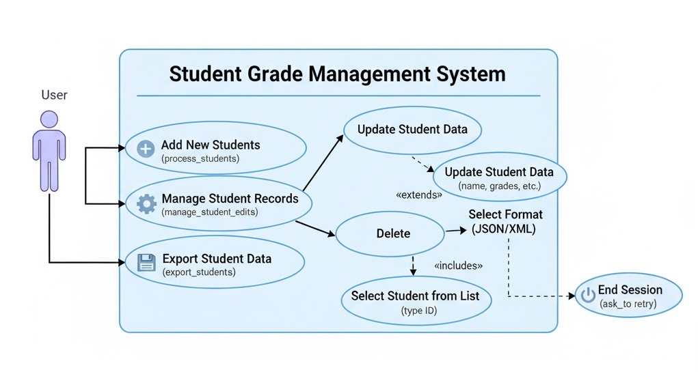

# Calculating Student Averages 🌐

<br>

## 📋 Description

This project calculates student averages using Object-Oriented Programming (OOP) principles in Python. The system allows for both arithmetic and weighted averages based on user input and provides a simple report card with each student's status (pass or fail) based on a customizable passing average.

The system uses a full SQLite database backend to provide persistent storage and full CRUD (Create, Read, Update, Delete) functionality. The architecture is built on a clean, object-oriented design, featuring a self-validating Student class (using @property setters) and a dedicated Data Access Layer (Repository Pattern) to ensure a clean separation between the application logic and the database.

The application has evolved into a modular and scalable solution, now supporting full CRUD operations on student records and strict adherence to [PEP 257](https://peps.python.org/pep-0257/) conventions for documentation.

<br>

---

## 🛠️ How to Use

1. **Clone the Repository**

2. Clone this repository to your local environment:

```bash
git clone https://github.com/apedrodev1/Python-Learning-HUB/tree/main/M%C3%A9dia%20aluno%20OOP
```

3. **Open the Project in Your IDE**  
   *(Make sure you have the Python extension installed)*

4. Open the `index.py` file in your preferred IDE.

5. Open a terminal, navigate to the project directory, and start the program:

```bash
python index.py
```

6. **Interact with the Program**
The database file (banco_de_dados.db) will be created automatically in src/bd/ on the first run.

</br>

---

## ✅ Logical Order Summary

### 🧠 Program Flow

```python
# 1. (index.py)
# Connect to DB and initialize the Repository
repo = StudentRepository(DB_PATH)

# 2. (index.py -> parameters.py)
# Get user settings (how many to add, passing grade, etc.)
students_quantity, ... = get_main_parameters()

# 3. (index.py -> main_function.py)
# 'process_students' gathers data for NEW students and calls:
repo.add_student(student) # -> CREATE

# 4. (index.py)
# Get the COMPLETE list of ALL students from the DB
students_list = repo.get_all_students() # -> READ

# 5. (index.py -> show_students.py)
# Display the complete list to the user
display_students(students_list)

# 6. (index.py -> manage_students.py)
# Run the main edit/delete workflow
manage_student_edits(students_list, repo)
    # -> (manage_students.py -> edit_student_form.py)
    # The form calls 'repo.update_student(student)' -> UPDATE
    # or 'repo.delete_student(student_id)' -> DELETE

# 7. (index.py -> export_wrapper.py)
# Export the complete list to JSON/XML
export_students(students_list)

# 8. (index.py -> loop_control.py)
# Ask to repeat the entire process
ask_to_retry()

# 9. (index.py)
# (In a 'finally' block) Ensure the DB connection is closed
repo.close()
```
<br>

### 👤 User Flow

1. **Input of Initial Data**
The program asks how many new students you want to add.

2. **Filling Student Data**
The program retrieves all students (new and old) from the DB and displays them.

3. **Displaying Report**
The program retrieves all students (new and old) from the DB and displays them.
4. **Optional Correction**
(CRUD): You can edit the name, grades, weights, or delete any student from the database.

5. **Optional Export**
 You can export the complete list to JSON or XML.

6. **Program Repeat Option**
The loop restarts (without losing any data).

</br>

---


## 🧩 Use Case Diagram

<p align="center">
  
</p>

</br>

---


## 🚀 Features

</br>

- **SQLite Database Backend:**  Data is fully persistent. All students and their grades are stored in an SQLite database (src/bd/banco_de_dados.db), ensuring no data is lost upon exit.

- **Full CRUD Functionality:** The system supports all database operations:

   - **Create: Adds new students** (process_students).

   - **Read:** Reads all students from the database (get_all_students).

   - **Update:** Edits names, grades, and weights of existing students (update_student).

   - **Delete:** Permanently removes students from the database (delete_student).

- **Repository Pattern (Data Access Layer):** A dedicated StudentRepository class (src/bd/repository.py) abstracts all SQL logic. The console interface (in functions/) does not know SQL; it simply calls methods like repo.add_student(student), making the code clean, modular, and easy to maintain.

- **Self-Validating Class (OOP):** The core of the project, the Student class, is "bulletproof." It uses properties (@property) and setters (@name.setter) to validate all data before it is set. An attempt like student.name = "123" will fail with a ValueError, ensuring data integrity even before it reaches the database.

- **PEP 257 Documentation:** All source code has been refactored to follow PEP 257 conventions, with clear docstrings in all modules, classes, and functions (in English).

- **Data Export (JSON & XML):** Exports the complete list of students from the database to formatted students.json or students.xml files.

- **Dynamic User Interface:** The program handles arithmetic and weighted averages, real-time user input validation, and a clean, colorful console interface.

</br>

---

## 🔮 Future Features

<br>


- `test_validations.py`: Unit tests for all validation routines.
- Send the results via email.
- Add graphs or other types of reports.
- User interface (GUI or web-based).


<br>

---

## 🗂️ Folder Structure

<br>


```
Média aluno OOP/
│
├── index.py                # Main entry point (Orchestrator)
├── README.md
│
├── src/
│   ├── bd/                 
│   │   ├── banco_de_dados.db   # Database file (created automatically)
│   │   ├── queries.py          # Script containing all SQL constants needed
│   │   └── repository.py       # StudentRepository class (CRUD)
│   │
│   ├── classes/
│   │   └── Student.py      # OOP core ("Encapsulated" Student class)
│   │
│   ├── functions/
│   │   ├── data/
│   │   │   ├── manage_students.py  # Manager (SELECT by ID)
│   │   │   └── edit_student_form.py# Form (UPDATE/DELETE a single student)
│   │   │
│   │   ├── export/
│   │   │   ├── export_wrapper.py   # Menu (JSON or XML?)
│   │   │   ├── json_exporter.py
│   │   │   └── xml_exporter.py
│   │   │
│   │   ├── loop_control.py   # Functions 'ask_to_retry' and 'clear_screen'
│   │   ├── main_function.py  # Form (CREATE - adds new students)
│   │   ├── parameters.py     # Collects initial parameters
│   │   ├── show_students.py  # Prints the formatted report
│   │   └── 
│   └── media                 # Images used in README.md
│   │      └── img
│   │           └── dev.pic.jpg
│   │           └── use_case_diagram.jpg
│   │
│   └── utils/
│       ├── colors.py         # ANSI color constants
│       └── formatters.py     # Pretty-print helper functions
│       └── validations.py    # Input validation utility functions

```
</br>

---

## 👨‍💻 Desenvolvedor

<p align="center">
  
</p>

<p align="center">
  <b>Pedro Augusto</b>  
  <br>
  <a href="https://github.com/apedrodev1">GitHub</a> &nbsp;|&nbsp;
  <a href="https://www.linkedin.com/in/pedro-augusto-rocha-548b28110/">LinkedIn</a> &nbsp;|&nbsp;
  <a href="https://www.instagram.com/apedrorocha/">Instagram</a>
</p>


---


